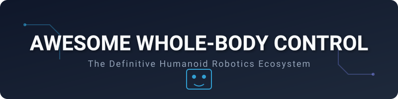

# 🤖 Awesome Whole-Body Control 🦾
### The Definitive Ecosystem for Humanoid Robot Dynamics, Locomotion & Manipulation

**Curated list of state-of-the-art SaaS platforms, commercial SDKs, and open-source GitHub projects focused on Whole-Body Control (WBC) for humanoid robots.**

---

[**Explore Projects**](#proprietary--commercial-tools) • [**Contribute**](#how-to-contribute) • [**Community**](#-community--resources)

## 🌟 Introduction

This repository is a comprehensive guide to the **Whole-Body Control (WBC)** ecosystem. WBC is the core technology that enables humanoid robots to perform dynamic, balanced, and multi-contact tasks. Whether you are a robotics researcher, a controls engineer, or a humanoid developer, this list provides the tools needed to solve complex dynamics, hierarchical optimization, and real-time motion planning.

### 🔑 Key Keywords
`Humanoid Robots` • `Whole-Body Control` • `Inverse Dynamics` • `Quadratic Programming` • `Model Predictive Control` • `Optimal Control` • `Robotics SDK` • `Physics Simulation`

---

## 🏗️ Proprietary / Commercial Tools

Commercial platforms and SDKs offering industry-grade Whole-Body Control interfaces, typically bundled with high-performance hardware.

| Product | Company Size (Valuation) | Pricing | Free Tier / Limits | Description |
| :--- | :--- | :--- | :--- | :--- |
| **[NVIDIA GR00T-WBC](https://nvidia-isaac.github.io/GR00T-WholeBodyControl/)** | **~$3.5 Trillion** | Hardware Cost | **Free for Individuals** | Advanced foundation models and Isaac Sim/Lab for research. |
| **[Flowstate (Intrinsic)](https://intrinsic.ai/)** | **~$2.1 Trillion** | **Contact Quote** | **Demo by request** | AI-enabled motion planning and whole-body force control. |
| **[Spot SDK (Boston Dynamics)](https://bostondynamics.com/)** | **~$25 Billion** | **$75,000+** | **None** | High-level API for balance, locomotion, and manipulation. |
| **[UBTECH Walker SDK](https://www.ubtrobot.com/)** | **~$5.0 Billion** | **Commercial Quote** | **None** | Coordinated whole-body motion control and multi-modal interaction suite. |
| **[Figure OS (Figure AI)](https://www.figure.ai/)** | **~$2.6 Billion** | **Enterprise License** | **None** | Autonomous whole-body dynamic control stack for Figure humanoids. |
| **[Agility Arc (Agility Robotics)](https://agilityrobotics.com/)** | **~$1.7 Billion** | **$250,000+/yr** (Lease) | **None** | Cloud automation platform and whole-body locomotion/manipulation API for Digit. |
| **[Unitree SDK (EDU)](https://www.unitree.com/)** | **~$1.5 Billion** | **$43,900+** | **None** | Low-level WBC access for G1 and H1 humanoid platforms. |
| **[1X Studio / NEO OS (1X)](https://www.1x.tech/)** | **~$1.0 Billion** | **Enterprise Quote** | **None** | Whole-body locomotion, manipulation, and teleoperation control stack for NEO and EVE. |
| **[Carbon OS (Sanctuary AI)](https://sanctuary.ai/)** | **~$500 Million** | **Enterprise Quote** | **None** | Cognitive architecture and whole-body teleoperation & dexterity control for Phoenix. |
| **[Fourier SDK (Fourier Intelligence)](https://www.fftai.com/)** | **~$300 Million** | **$40,000+** | **None** | Dynamic whole-body balance and locomotion control platform for GR-1/GR-2 humanoids. |
| **[Apollo OS (Apptronik)](https://apptronik.com/)** | **~$200 Million** | **Enterprise Quote** | **None** | Whole-body control architecture and mobility software suite for Apollo humanoid. |
| **[ANYmal SDK (ANYbotics)](https://www.anybotics.com/)** | **~$150 Million** | **$150,000+** | **None** | Industrial whole-body locomotion and torque control SDK for legged robots. |
| **[OpenLoong (Dyn-Control)](https://openloong.org.cn/)** | **~$140 Million** | **Free** (Apache 2.0) | **Unlimited** | Control stack for the Qinglong humanoid research series. |
| **[TALOS WBC SDK (PAL Robotics)](https://pal-robotics.com/)** | **~$50 Million** | **Custom Quote** | **ROS Wrapper Open** | Stack-of-tasks whole-body torque and kinematic control for TALOS and TIAGo. |
| **[Tritium OS (Engineered Arts)](https://www.engineeredarts.co.uk/)** | **~$30 Million** | **Subscription** | **Demo by request** | Cloud operating system for real-time expressive whole-body humanoid animation and control. |

---

## 🔓 Open-Source GitHub Projects

The heart of the robotics research community. These libraries provide the mathematical foundations for modern humanoid control.

- **[MuJoCo](https://github.com/google-deepmind/mujoco)**   
  🚀 *The gold standard for physics simulation.* High-performance contact dynamics for RL-based control.

- **[Drake](https://github.com/RobotLocomotion/drake)**   
  🛠️ *Model-based design & optimization.* Comprehensive C++ toolbox for control, estimation, and planning.

- **[Pinocchio](https://github.com/stack-of-tasks/pinocchio)**   
  ⚡ *Blazing fast rigid body dynamics.* The core library for calculating Jacobians, mass matrices, and kinematics.

- **[MIT Cheetah-Software](https://github.com/mit-biomimetics/Cheetah-Software)**   
  🐆 *State-of-the-art dynamic locomotion.* High-performance convex MPC and WBC stack for legged and humanoid robots.

- **[RSL-RL](https://github.com/leggedrobotics/rsl_rl)**   
  🤖 *Fast Reinforcement Learning for Legged Robots.* Highly parallelized on-policy algorithms for whole-body locomotion.

- **[CasADi](https://github.com/casadi/casadi)**   
  📐 *Algorithmic Differentiation & Numeric Optimization.* General-purpose tool for non-linear optimal control and WBC.

- **[OSQP](https://github.com/osqp/osqp)**   
  ⚡ *Operator Splitting QP Solver.* Fast, robust convex quadratic programming solver ubiquitous in real-time MPC and WBC.

- **[OCS2](https://github.com/leggedrobotics/ocs2)**   
  📉 *Optimal Control for Switched Systems.* Specialized in legged robot locomotion and whole-body tasks.

- **[Crocoddyl](https://github.com/loco-3d/crocoddyl)**   
  🧬 *Contact-consistent trajectory optimization.* Built on Pinocchio for highly dynamic maneuvers.

- **[DART](https://github.com/dartsim/dart)**   
  🎯 *Dynamic Animation and Robotics Toolkit.* Multi-body dynamic simulator tailored for kinematic control and animation.

- **[Pink](https://github.com/stephane-caron/pink)**   
  🐍 *Pythonic Inverse Kinematics.* Easy-to-use WBC for rapid prototyping and simulation.

- **[qpsolvers](https://github.com/stephane-caron/qpsolvers)**   
  ⚙️ *Unified QP Solvers in Python.* Common interface across multiple quadratic programming solvers for robot control.

- **[RBDL](https://github.com/rbdl/rbdl)**   
  📦 *Rigid Body Dynamics Library.* Lightweight and efficient C++ implementation for real-time control.

- **[qpOASES](https://github.com/coin-or/qpOASES)**   
  ⚖️ *Real-time QP Solver.* The workhorse for constrained optimization in whole-body control.

- **[RaiSim](https://github.com/raisimTech/raisimLib)**   
  🐕 *Legged Robotics Physics.* Optimized for fast simulation of complex contact scenarios.

- **[TSID](https://github.com/stack-of-tasks/tsid)**   
  🎛️ *Task Space Inverse Dynamics.* Efficient C++ whole-body control library implementing hierarchical QP.

- **[iDynTree](https://github.com/robotology/idyntree)**   
  🌲 *Multi-body dynamics for humanoid robots.* Dynamics and kinematics library supporting whole-body momentum control.

- **[eiquadprog](https://github.com/stack-of-tasks/eiquadprog)**   
  🔢 *Efficient Quadratic Programming.* Optimized for hierarchical whole-body control and constrained tasks.

- **[OmniSim](https://github.com/omnilink-tech/omnisim)**   
  🌐 *Robotics Simulator for Coding Agents.* HTTP/JSON + MCP control, Newton physics, wgpu rendering, and ROS 2 integration.

---

## 🤝 How to Contribute

We welcome contributions from the community! 🚀

1. **Fork** the repository.
2. **Add** your entry to `README.md` (ensure it's in the correct sorted order).
3. **Verify** all links and provide a concise 1-2 sentence description.
4. **Submit** a Pull Request with a clear explanation of why the tool is "Awesome".

---

## 📚 Community & Resources

- [Reddit Robotics](https://reddit.com/r/robotics)
- [IEEE Spectrum Robotics](https://spectrum.ieee.org/robotics)
- [Awesome Humanoids List](https://github.com/topics/humanoid-robot)

---

## 📈 Star History

   <a href="https://www.star-history.com/?repos=ishandutta2007%2FAwesome-Whole-Body-Control&type=date&legend=bottom-right">
    <picture>
      <source media="(prefers-color-scheme: dark)" srcset="https://api.star-history.com/chart?repos=ishandutta2007/Awesome-Whole-Body-Control&type=date&theme=dark&legend=bottom-right" />
      <source media="(prefers-color-scheme: light)" srcset="https://api.star-history.com/chart?repos=ishandutta2007/Awesome-Whole-Body-Control&type=date&legend=bottom-right" />
      
    </picture>
   </a>

---

## ⚠️ Disclaimer

- This is a community-curated list and does not constitute an endorsement.
- Robotics software should be tested in **simulation** before deployment on physical hardware.
- Use at your own risk. Safety first! 🛡️

---

  <b>Made with ❤️ for the Robotics Community</b> 
  <i>Join us in building the future of humanoid motion.</i>

